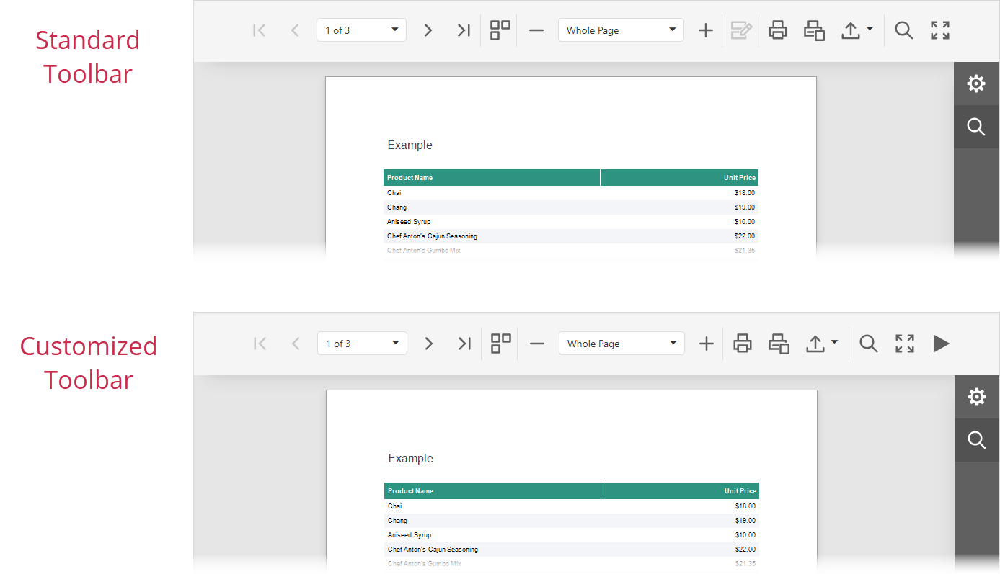

<!-- default badges list -->
[](https://supportcenter.devexpress.com/ticket/details/T1235063)
[](https://docs.devexpress.com/GeneralInformation/403183)
<!-- default badges end -->
# Reporting for React - Customize Viewer Toolbar

This example uses the `CustomizeMenuActions` event to hide the **Highlight Editing Fields** toolbar command and add a new **Run Slide Show** command to navigate through report pages.



## Quick Start 

### Server

In the *backend* folder, run the following command:

```
dotnet run
```

The server starts at `http://localhost:5000`. To debug the server, run the application in Visual Studio.

### Client

In the *react-document-viewer* folder, run the following commands:

```
npm install
npm run dev
```

Open `http://localhost:3000/` in your browser to view the result. 

## Implementation Details

### Hide Toolbar Command

To access a built-in toolbar command, call the `GetById` method and pass the [`ActionId`](https://docs.devexpress.com/XtraReports/js-DevExpress.Reporting.Viewer.ActionId) value as a parameter. To hide a command and its toolbar button, set the command's `visible` property to `false`.

```ts
const onCustomizeMenuActions = ({ sender, args }: { sender: any, args: any }) => {
    var highlightEditingFieldsAction = args.GetById(ActionId.HighlightEditingFields);
    if (highlightEditingFieldsAction)
        highlightEditingFieldsAction.visible = false;
};
```

### Add New Toolbar Command

To add a new toolbar command, follow the steps below:

1. Create an image template:

    ```ts
    // ...
    const templateEngine = new TemplateEngine();
    templateEngine.setTemplate('slideshow', () => (
      <svg version="1.1" xmlns="http://www.w3.org/2000/svg" x="0px" y="0px" viewBox="0 0 24 24">
        <polygon className="dxd-icon-fill" points="4,2 4,22 22,12 " />
      </svg>
    ));
    // ...
    ```

2. Specify command settings. Set the [`imageTemplateName`](https://docs.devexpress.com/XtraReports/js-DevExpress.Analytics.Utils.IAction?p=netframework#js_devexpress_analytics_utils_iaction_imagetemplatename) property to the created template's id (`slideshow`):

    ```ts
    const onCustomizeMenuActions = ({ sender, args }: { sender: any, args: any }) => {
      let interval: any;
      const action = new CustomAction({
        text: "Run Slide Show",
        imageTemplateName: "slideshow",
        visible: true,
        disabled: false,
        selected: false,
        clickAction: function () {
          if (this.selected) {
            clearInterval(interval);
            this.selected = false;
            return;
          }
          var model = sender.GetPreviewModel();
          if (model) {
            this.selected = true;
            interval = setInterval(function () {
              var pageIndex = model.GetCurrentPageIndex();
              model.GoToPage(pageIndex + 1);
            }, 2000);
          }
        }
      });
      // ...
    };
    ```

3. Call the `push` method to add the created command to `Actions` collection:

    ```ts
    const onCustomizeMenuActions = ({ sender, args }: { sender: any, args: any }) => {
      // ...
      args.Actions.push(action);
    };
    ```
    
## Files to Review

- [page.tsx](react-documenent-viewer/src/app/page.tsx)

## Documentation

- [Reporting for React](https://docs.devexpress.com/XtraReports/119338)
- [Customize the Document Viewer Toolbar](https://docs.devexpress.com/XtraReports/401946)

## More Examples

- [Reporting for React - Add a Web Document Viewer to a React App](https://github.com/DevExpress-Examples/reporting-react-integrate-web-document-viewer)
- [Reporting for React -  Customize Parameter Editor in the Web Document Viewer](https://github.com/DevExpress-Examples/reporting-react-customize-parameter-editor)
